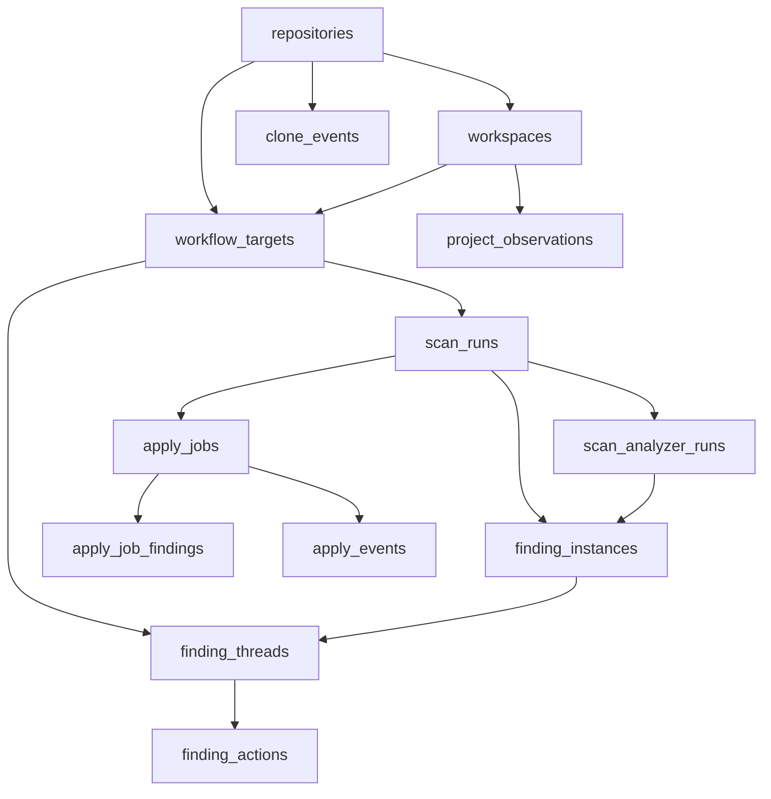

# Migrating Into Persistent Memory With SQLite

## Why The Plan Changed
The codebase now has more durable product concepts than the earlier persistence plan covered:

- `scan` is no longer the only long-running workflow.
- `apply` is now a first-class async job with PR creation and retry behavior.
- scan completion depends on both analyzer completion and project-summary completion.
- the analyzer surface has expanded beyond the original API analyzers.
- the frontend now has finding selection, prompt generation, apply flow, recent-project discovery, clone flow, and report deep-linking.
- the app already persists state in multiple places today:
  - backend JSON files via [backend/store.py](backend/store.py)
  - frontend `localStorage` via [frontend/src/utils/appliedFindings.ts](frontend/src/utils/appliedFindings.ts)
  - in-memory caches such as [backend/recent_projects.py](backend/recent_projects.py)

The migration plan should therefore cover:
- durable run history
- durable apply history
- stable finding identities
- workflow-level history on a repository
- migration away from redundant JSON and browser-only persistence

## Updated Product Model
The current app is best modeled as four layers:

1. **Repository**
   - The logical codebase, ideally anchored to git root and optional remote URL.
2. **Workspace**
   - A local path or cloned copy of that repository.
3. **Workflow Target**
   - The scope the user is analyzing or applying against, for example:
     - full repository
     - entry path
     - custom workflow path
4. **Run**
   - A concrete execution:
     - `scan`
     - `apply`

This structure supports questions like:
- show me all past runs for this workflow on this repository
- show me what we already applied from prior analyses
- show me what findings are still open on this workflow

## Recommended SQLite Schema
Use normalized tables for queryable fields plus JSON payload columns for forward compatibility.

### Core Identity Tables

#### `repositories`
- `id`
- `git_root` unique
- `display_name`
- `remote_url`
- `provider`
- `default_branch`
- `created_at`
- `updated_at`
- `metadata_json`

#### `workspaces`
- `id`
- `repository_id`
- `canonical_path` unique
- `source` (`manual`, `cursor`, `vscode`, `claude_code`, `clone`, `sample_project`)
- `first_seen_at`
- `last_seen_at`
- `last_scanned_at`
- `is_demo`
- `metadata_json`

#### `workflow_targets`
- `id`
- `repository_id`
- `workspace_id`
- `target_type` (`full_repo`, `entry_path`, `custom_scope`)
- `display_name`
- `entry_path`
- `workflow_key`
- `config_json`
- `created_at`
- `updated_at`

`workflow_key` should be deterministic so repeated runs of the same workflow group together cleanly.

### Scan Tables

#### `scan_runs`
- `id` UUID text
- `repository_id`
- `workspace_id`
- `workflow_target_id`
- `requested_path`
- `scan_mode` (`live`, `demo`)
- `status`
- `requested_at`
- `started_at`
- `completed_at`
- `duration_ms`
- `error_text`
- `no_claude_usage`
- `project_summary_json`
- `project_summary_status`
- `project_summary_error`
- `scorecard_json`
- `findings_count`
- `scanner_version`
- `git_branch`
- `git_head_sha`
- `summary_json`

#### `scan_analyzer_runs`
- `id`
- `scan_run_id`
- `analyzer_type`
- `analyzer_group`
- `status`
- `started_at`
- `completed_at`
- `duration_ms`
- `model_name`
- `prompt_version`
- `prompt_hash`
- `result_count`
- `error_text`
- `note_text`
- `raw_output_json`

This must support the current analyzer set, including:
- API analyzers
- agentic analyzers
- future analyzers without schema churn

#### `finding_instances`
- `id`
- `scan_run_id`
- `scan_analyzer_run_id`
- `repository_id`
- `workflow_target_id`
- `analyzer_type`
- `fingerprint`
- `title`
- `model`
- `file_path`
- `line_start`
- `line_end`
- `function_name`
- `docs_url`
- `cost_reduction`
- `latency_reduction`
- `reliability_improvement`
- `confidence`
- `effort`
- `estimated_savings_detail`
- `finding_json`
- `sort_order`

### Stable Finding Tables

#### `finding_threads`
Stable identity across repeated runs of the same workflow.

- `id`
- `repository_id`
- `workflow_target_id`
- `fingerprint`
- `status` (`open`, `resolved`, `suppressed`)
- `first_seen_scan_run_id`
- `last_seen_scan_run_id`
- `first_seen_at`
- `last_seen_at`
- `occurrence_count`
- `latest_title`
- `latest_analyzer_type`
- `latest_finding_instance_id`
- `user_note`

Use `workflow_target_id + fingerprint` as the primary grouping concept, not just repository-wide grouping.

#### `finding_actions`
Tracks how users interact with findings over time.

- `id`
- `finding_thread_id`
- `finding_instance_id`
- `scan_run_id`
- `action_type`
- `payload_json`
- `created_at`

Recommended action types based on the current UI:
- `selected`
- `selection_cleared`
- `generated_prompt`
- `copied_fix`
- `opened_docs`
- `apply_started`
- `apply_completed`
- `dismissed`
- `accepted`
- `resolved`
- `reopened`

### Apply Tables

#### `apply_jobs`
- `id` UUID text
- `repository_id`
- `workspace_id`
- `workflow_target_id`
- `source_scan_run_id`
- `project_path`
- `status`
- `started_at`
- `completed_at`
- `duration_ms`
- `error_text`
- `prompt_text`
- `selection_count`
- `selection_fingerprint`
- `git_head_before`
- `git_head_after`
- `pr_url`
- `pr_branch`
- `pr_error`
- `result_summary_json`

#### `apply_job_findings`
- `id`
- `apply_job_id`
- `finding_thread_id`
- `finding_instance_id`
- `ordinal`
- `title`
- `file_path`
- `docs_url`
- `summary_json`
- `status`

This table is necessary because the current `apply` request is built from selected findings, not just a single scan-level command.

#### `apply_events`
- `id`
- `apply_job_id`
- `sequence_no`
- `event_type`
- `created_at`
- `payload_json`

Stores streamed `apply_output`, PR creation results, per-finding progress, and terminal events.

### Discovery And Settings Tables

#### `project_observations`
- `id`
- `workspace_id`
- `source`
- `observed_at`
- `rank_hint`
- `payload_json`

This captures editor discovery and clone/manual input history without confusing it with scan history.

#### `clone_events`
- `id`
- `repository_id`
- `workspace_id`
- `github_url`
- `destination_path`
- `status`
- `created_at`
- `error_text`

This is optional, but useful now that clone is already a product flow.

#### `app_settings`
- `key`
- `value_json`
- `updated_at`

#### `schema_migrations`
- `version`
- `applied_at`

## Relationships

## Current Persistence Mechanisms To Migrate Away From

### Backend JSON persistence
Current app-owned persistence:
- [backend/store.py](backend/store.py)
  - persists scan JSON files
  - persists apply JSON files
  - loads them back into memory
  - TTL-cleans memory and files

This should be replaced by SQLite-backed repositories plus in-memory SSE queues only.

### Frontend localStorage
Current browser-only persistence:
- [frontend/src/utils/appliedFindings.ts](frontend/src/utils/appliedFindings.ts)
  - stores applied finding keys in `localStorage`

This should migrate into SQLite-backed `finding_actions` and `apply_job_findings`, with an API response that gives the frontend stable server-side IDs.

### In-memory cache
Current ephemeral cache:
- [backend/recent_projects.py](backend/recent_projects.py)
  - short-lived in-process cache for recent-project aggregation

This can remain ephemeral. It does not need to move into SQLite unless profiling later shows value in a cached table.

### Keep as configuration or external reads
These should not move into SQLite as first-party domain state:
- `.env` and settings flags in [backend/settings.py](backend/settings.py)
- external editor storage reads in [backend/recent_projects.py](backend/recent_projects.py)
- Claude chat history reads in `chat_history_extractor`

## Migration Strategy

### Phase 1: Introduce SQLite as source of truth
- Add `backend/data/claude_optimize.db`
- enable WAL and foreign keys
- create migration runner
- add startup recovery:
  - scans stuck in `running` -> `failed`
  - apply jobs stuck in `running` -> `failed`

### Phase 2: Dual-write temporarily
For a short transition window:
- write new runs into SQLite
- continue existing JSON persistence in `store.py`
- compare loaded results in development until confidence is high

Then remove:
- disk JSON save/load in `store.py`
- JSON file cleanup logic tied to those stores

### Phase 3: Migrate browser-only “applied findings”
Current state:
- browser `localStorage` stores synthetic finding keys

Migration:
- add stable `finding_instance_id` to scan API responses
- add `finding_thread_id` or stable finding identity for cross-scan state
- backend returns applied/action state with the report payload or a companion endpoint
- frontend reads from server-backed state first
- keep `localStorage` as a one-time fallback import path
- on first report load after migration:
  - read old `localStorage`
  - map keys to current findings where possible
  - write corresponding `finding_actions`
  - clear old `localStorage` entry after successful import

Then remove:
- [frontend/src/utils/appliedFindings.ts](frontend/src/utils/appliedFindings.ts)
- any `localStorage` reads in [frontend/src/pages/Report.tsx](frontend/src/pages/Report.tsx)

### Phase 4: Tie apply jobs to scans and findings
Current problem:
- `apply` payloads do not reliably reference stable server-side finding IDs

Migration:
- extend `POST /api/apply` to accept:
  - `source_scan_run_id`
  - `finding_instance_ids[]`
  - optionally `workflow_target_id`
- keep old parallel arrays temporarily for compatibility
- server derives `apply_job_findings` from stable IDs

Then remove redundant request fields after frontend adoption:
- `finding_titles`
- `finding_files`
- `finding_docs_urls`
- possibly `finding_summaries` if reconstructable server-side

### Phase 5: Add history UX
- add a scan history page
- group past runs by repository and workflow target
- show:
  - all past runs for a workflow
  - findings still open
  - applies made from prior scans
  - PR links and statuses

## Redundant Code Expected To Be Removed

After migration is complete, these areas should likely shrink or disappear:

- JSON persistence logic in [backend/store.py](backend/store.py)
  - file-path helpers
  - `_save_*`
  - `_load_*`
  - delete-on-expiry file cleanup
- browser-only applied-finding persistence in [frontend/src/utils/appliedFindings.ts](frontend/src/utils/appliedFindings.ts)
- scan/apply request redundancy once stable IDs are available
- any UI logic that depends only on synthetic finding keys like `file:lines:title`

## API Changes Needed

### Existing endpoints that should become SQLite-backed
- `GET /api/scan/{scan_id}`
- `GET /api/scan/{scan_id}/stream`
- `GET /api/apply/{apply_id}`
- `GET /api/apply/{apply_id}/stream`
- `GET /api/projects/recent`

### New endpoints recommended
- `GET /api/repositories`
- `GET /api/repositories/{repository_id}/workflows`
- `GET /api/workflows/{workflow_target_id}/runs`
- `GET /api/workflows/{workflow_target_id}/findings`
- `POST /api/findings/{finding_instance_id}/actions`
- `GET /api/applies/{apply_id}/findings`
- optional `GET /api/repositories/{repository_id}/applies`

## Implementation Notes

- Add `finding_instance_id` to scan report responses.
- Add `workflow_target_id` to both scan and apply history surfaces.
- Persist `project_summary_*` fields exactly as they exist now.
- Support the expanded analyzer taxonomy, including agentic analyzers and future additions.
- Keep JSON payload storage for findings and summaries to avoid constant migrations as analyzers evolve.
- Keep demo scans ephemeral unless we explicitly decide demo history is valuable later.

## Recommended Execution Order

1. introduce database module and migrations
2. model repositories, workspaces, and workflow targets
3. persist scans and analyzer runs
4. persist findings and stable finding threads
5. persist apply jobs and apply events
6. add ID-based finding selection/apply contracts
7. migrate old local and JSON persistence
8. add history UI on top of stable stored data
